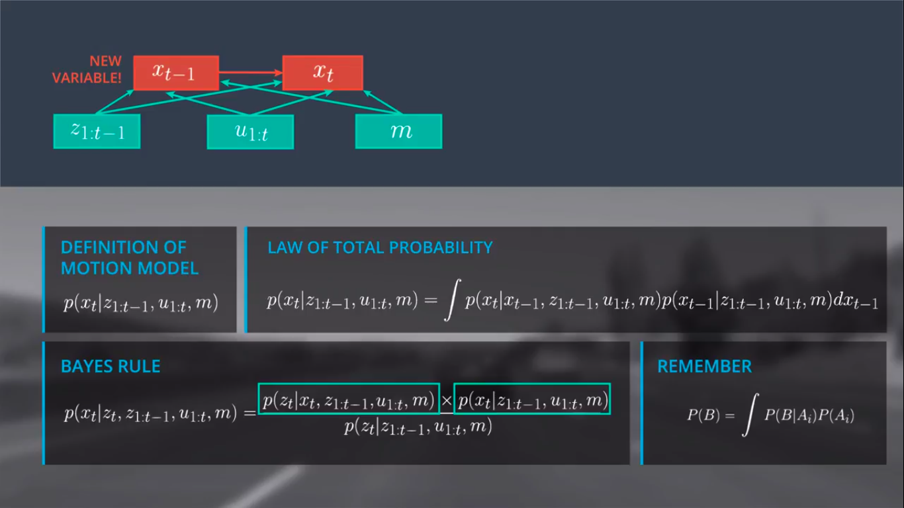
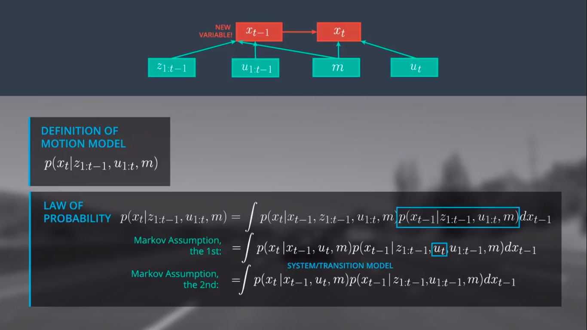
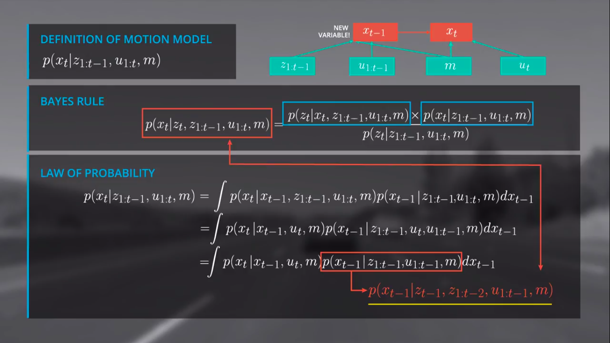
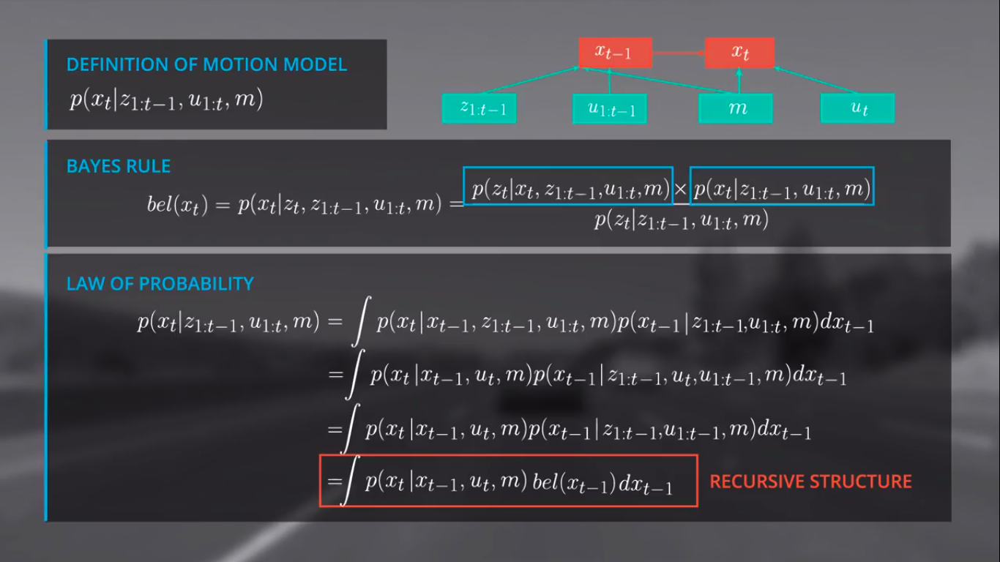
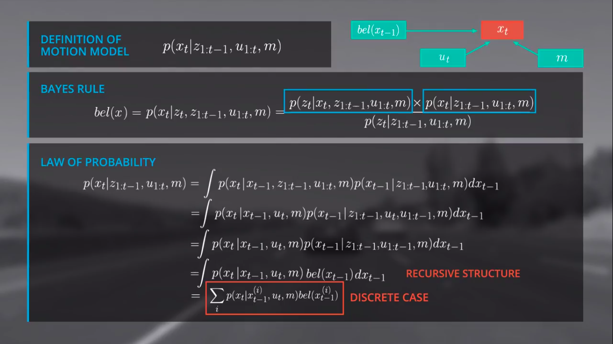

# Markov Localisation-3

---

## Apply Bayes Rule with additional conditions
- manipulate posterior in such a way that we get a **recursive state estimate**
  - [Wiki page for recursive state estimation](https://en.wikipedia.org/wiki/Recursive_Bayesian_estimation#Model)
- avoid to carry all data
- 3 things:
  1. Bayes Rule
  2. Law of total probability
  3. Markov Assumption

## Bayes Rule
Steps:
1. Split into current and previous: $bel(x_t) = p(x_t|z_t, z_{1:t-1}, u_{1:t}, m)$
2. apply bayes rule with multiple parameters

Bayes filter:
- Likelihood: Observation Model : $p(z_t|x_t, z_{1:t-1}, u_{1:t}, m)$
- Prior: Motion Model : $p(x_t|z_{1:t-1}, u_{1:t}, m)$
- Normalizer: $\frac{1}{p(z_t|z_{1:t-1}, u_{1:t}, m)}$ : sum of motion model and observation model over all states
- Filter : $\frac{Observation model * Motion model}{Normalizer}$
- $=>$ Only have to define motion and observation model to estimate the beliefs

Note:
No current observations in the motion model

## Law of total prob and Markov assumption to include a new variable $x_{t-1}$
- Problem : $x_{t-1}$

- A stochastic process has the Markov property if the conditional probability distribution of future states of the process (conditional on both past and present states) depends only upon the present state, not on the sequence of events that preceded it.
  - [Wiki page for Markov prop](https://en.wikipedia.org/wiki/Markov_property)
- A Markov process is one in which the conditional probability distribution of future states (ie the next state) is dependent only upon the current state and not on other preceding states. This can be expressed mathematically as: $P(x_t|x_{1-t},....,x_{t-i},...., x_0) = P(x_t|x_{t-1})$
- It is important to note that the current state may contain all information from preceding states.

## Further modifications (to the integral stuff)
1. Since we (hypothetically) know in which state the system is at time step $t-1$, the past observations $z_{1:t-1}$ and controls $u_{1:t-1}$ would not provide us additional information to estimate the posterior for $x_t$ , because they were already used to estimate $x_{t-1}$ . This means, we can simplify $p(x_t|x_{t-1}, z_{1:t-1}, u_{1:t},m)$ to $p(x_t|x_{t-1}, u_t, m)$.

2. Since $u_t$ is “in the future” with reference to $x_{t-1}$, $u_t$ does not tell us much about $x_{t-1}$. This means the term $p(x_{t-1}|z_{1:t-1}, u_{1:t}, m)$ can be simplified to $p(x_{t-1}|z_{1:t-1}, u_{1:t-1}, m)$

## After applying Markov
- TRUE: After applying the Markov Assumption, the term $p(x_{t-1} | z_{1:t-1}, u_{1:t-1}, m)$ describes exactly the belief at $x_{t-1}$. This means we achieved a recursive structure!
- FALSE: After applying the Markov Assumption, we can neglect the term $p(x_{t-1} | z_{1:t-1}, u_{1:t-1}, m)$ completely and we only have to estimate the posterior.

## Recursive structure
- How recursive?

- replace $z_{1:t-1}$, $u_{1:t-1}$ with $bel$.
- We'll implement in discretized form

Note:
$x_{t=0}$ should be meaningful. Ex. use a GPS to get a cross estimate of where you are.

## Summing up
1. How to apply the law of total probability by including the new variable $x_{t-1}$
2. The Markov assumption, which is very important for probabilistic reasoning, and allows us to make recursive state estimation without carrying our entire history of information
3. How to derive the recursive filter structure.
