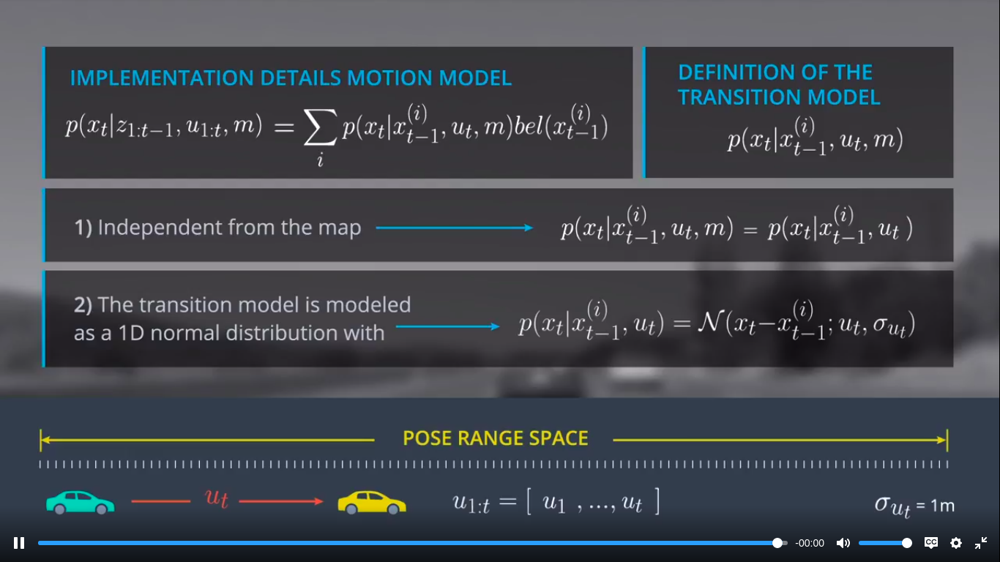
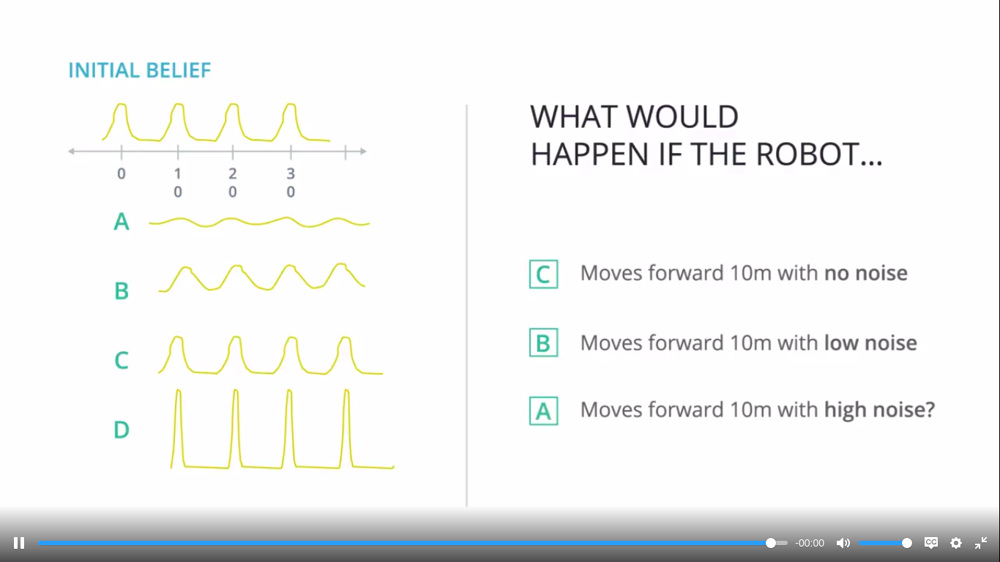

# Motion Model-1

---

## Motion Model
$p(x_t|z_{1:t-1}, u_{1:t}, m)$

## Assumptions
1. Car is parked at a landmark +-1 : for initial belief
2. Transition model controlled only by $x_{t-1}$ and $u_t$ : independent from map
3. Transition model is modeled as a 1d normal distribution
  - evaluate at position $x_t|x_{t-1}^{(i)}$
  - sigma = 1m
4. Range = 0 to 99 m

## Note
- No noise doesn't mean high precision
- With no noise, it remains the same

- Transition probability, $P(transition)$ can be calculated by normalised pdf function.
- Control parameter is mu (mean). It is taken movement_per_timestep in implementation
