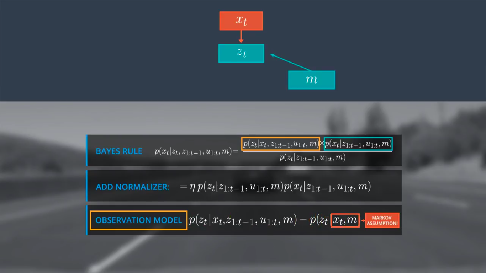
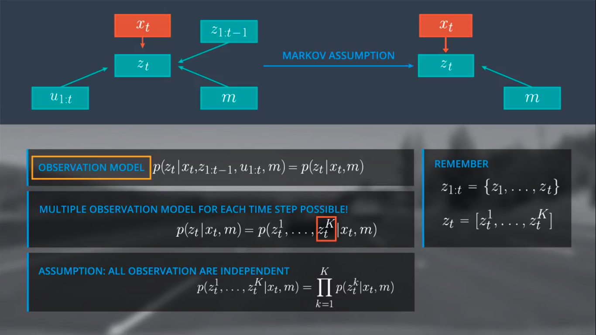
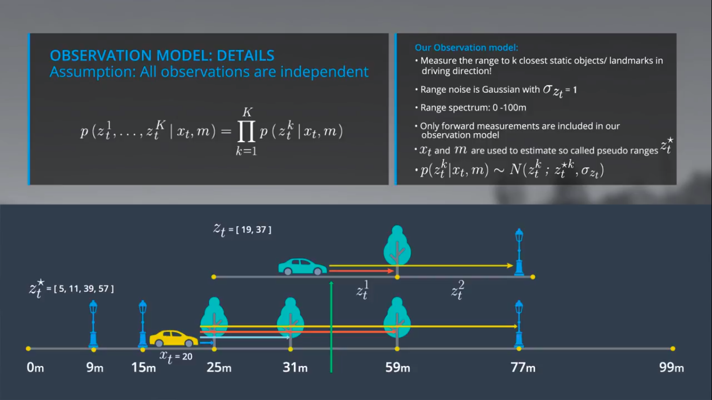

# Observation Model-1

---

## Observation Model
$p(z_t|x_t, z_{1:t-1}, u_{1:t}, m)$

## Markov Assumption for Observation Model
- We can use Markov Assumption to manipulate/simplify the observation model

- Thus, it turns to this. The $z_t$ term can be a vector of multiple observations. For each timestep, we have multiple observation models and all are independent.

## Note
Question: How to define the observation model for a single range measurement?

## Assumptions
Observation depends on:
- Different sensors
- They have different noise behavior
- Map types, like grid maps

Assumptions:
1. All observations are independent
2. We assume that the noise behavior of the individual range values $z_t^1$  to $z_t^k$	is independent.**This allows us to represent the observation model as a product over the individual probability distributions of each single range measurement.**

- Notice PSEUDO RANGES. Mean for the normal distibution is taken as *pseudo_range_of_k* (The probablity of car to be at the *pseudo_range_of_k*  is more, like take it as a mean, start at that position ). Take a look at the green arrow for an intuition of the mean.

## Explanation
In general there exists a variety of observation models due to different sensor, sensor specific noise behavior and performance, and map types. For our 1D example we assume that our sensor measures to the n closest objects in the driving direction, which represent the landmarks on our map. We also assume that observation noise can be modeled as a Gaussian with a standard deviation of 1 meter and that our sensor can measure in a range of 0 – 100 meters.

To implement the observation model we use the given state $x_t$, and the given map to estimate pseudo ranges, which represent the true range values under the assumption that your car would stand at a specific position $x_t$, on the map. For example, if our car is standing at position 20 it would make use $x_t$, and m to make pseudo range ( $z_t^*$ ) observations in the order of the first landmark to the last landmark or 5, 11, 39, and 57 meters. Compared to our real observations ( $z_t$= [19, 37]) the position $x_t$, = 20 seems unlikely and our observation would rather fit to a position around 40.

Based on this example the observation model for a single range measurement is defined by the probability of the following normal distribution $p(z_t^k|x_t )\tilde\ N(z_t^k,z_t^{*k},\sigma z_t)$ where $z_t^{*k}$ is the mean. This insight will ultimately allow us to implement the observation model in c++.
