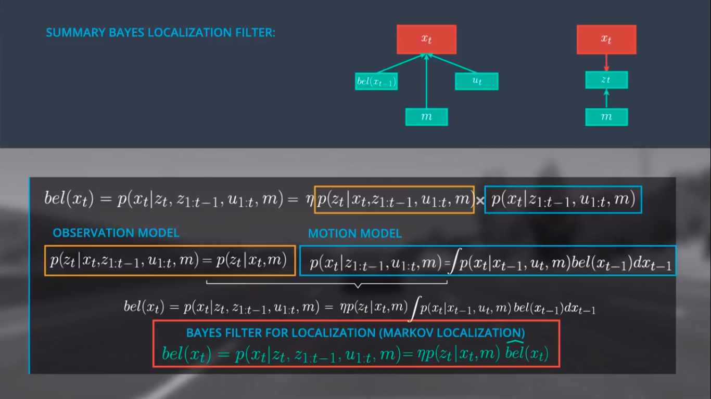
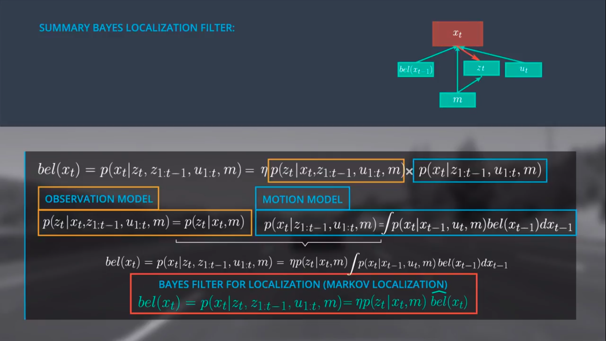
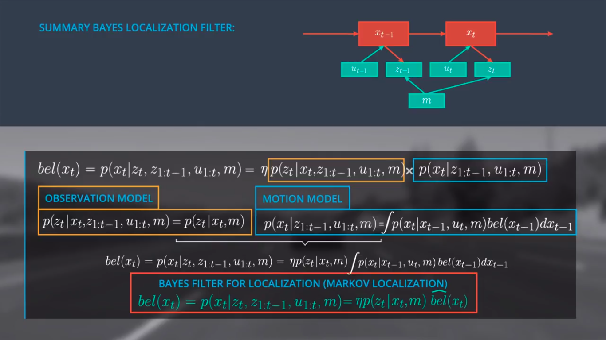

# Observation Model-2

---

## Finalise the Bayes Localisation Filter
- belief = normalizer ($\eta$) * observation model * motion model

- Combining the motion and observation model graphs (Representing dependencies)

- More

## Summary so far
- Starting with the generalized form of Bayes Rule we expressed our posterior, the belief of x at t as $\eta$ (normalizer) multiplied with the observation model and the motion model.
- We simplified the observation model using the Markov assumption to determine the probability of z at time t, given only x at time t, and the map.
- We expressed the motion model as a recursive state estimator using the Markov assumption and the law of total probability, resulting in a model that includes our belief at t–1 and our transition model.
- Finally we derived the general Bayes Filter for Localization (Markov Localization) by expressing our belief of x at t as a simplified version of our original posterior expression (top equation), $\eta$ multiplied by the simplified observation model and the motion model. Here the motion model is written as $\hat{bel}$, a prediction model.

## Note
It is a common practice to represent this filter without the belief $x_t$ and to remove the map from the motion model. Ultimately we define $bel(x_t)$ as the following expression:

$bel(x_t)=p(x_t | z_t, z_{1:t-1}, \mu_{1:t}, m) = \eta*p(z_t | x_t, m) \hat{bel}(x_t)$
