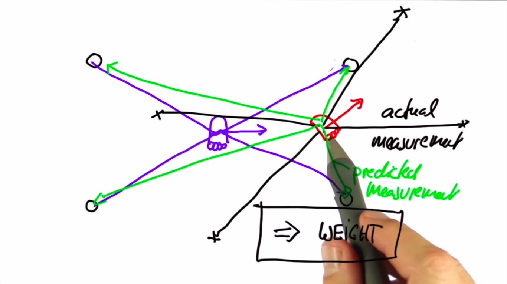

# Particle Filter-1

---

## Comparison
<table>
  <tr>
    <th>-</th>
    <th>State Space</th>
    <th>Belief</th>
    <th>Efficiency</th>
    <th>In robotics</th>
  </tr>
  <tr>
    <td>Histogram Filters</td>
    <td>Discrete</td>
    <td>Multimodal</td>
    <td>Exponential</td>
    <td>Approximate</td>
  </tr>
  <tr>
    <td>Kalman Filters</td>
    <td>Continuous</td>
    <td>Unimodal</td>
    <td>Quadratic</td>
    <td>Approximate</td>
  </tr>
  <tr>
    <td>Particle Filters</td>
    <td>Continuous</td>
    <td>Multimodal</td>
    <td>?</td>
    <td>Approximate</td>
  </tr>
</table>

## Stuff
- Easy to program
- Set of thousands of guesses make a filter
- Particle filter: how consistent particles are in comparison with the sensor measurements
- Essence: Help particles guess where the robot might be moving, also help them survive using survival of the fittest

## About the code
- Circular world
- N=1000: no. of particles
- A particle: $$ \begin{bmatrix} x_{coordinate} \\ y_{coordinate} \\ angle_{initial facing} \end{bmatrix} $$
- `p[i]=robot()`

## Particle Filter

- 2 particles: purple and red
- If we put the given measurement on both and purple fits perfectly while red is absurd
- This can be used to filter out particles.
- Weight: take actual measurement and predicted measurement into account, particles which are far away are worthless.$$ weight \propto importance \propto prob(survival) $$
- Resampling:
  - Randomly drawing N new particles from the old ones with replacement with proportion to their importance weight.
  - Particles consistent with sensor measurements survive, ones with lower importance weight tend to die out.
