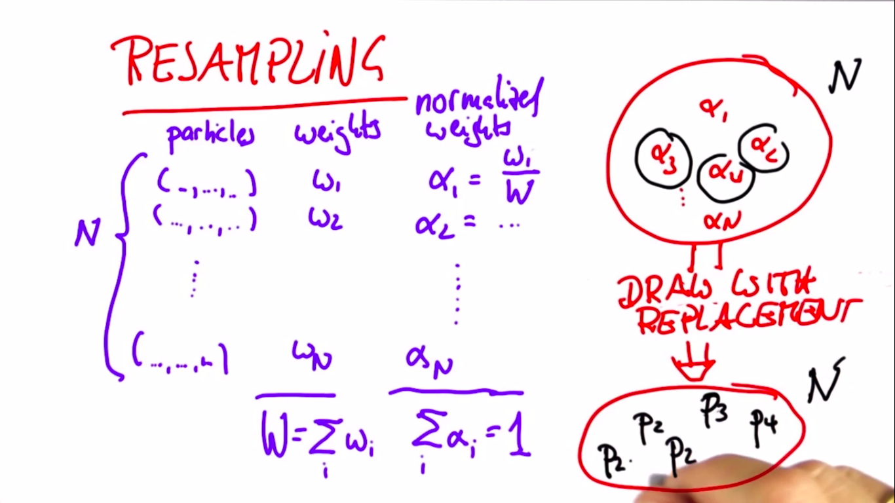
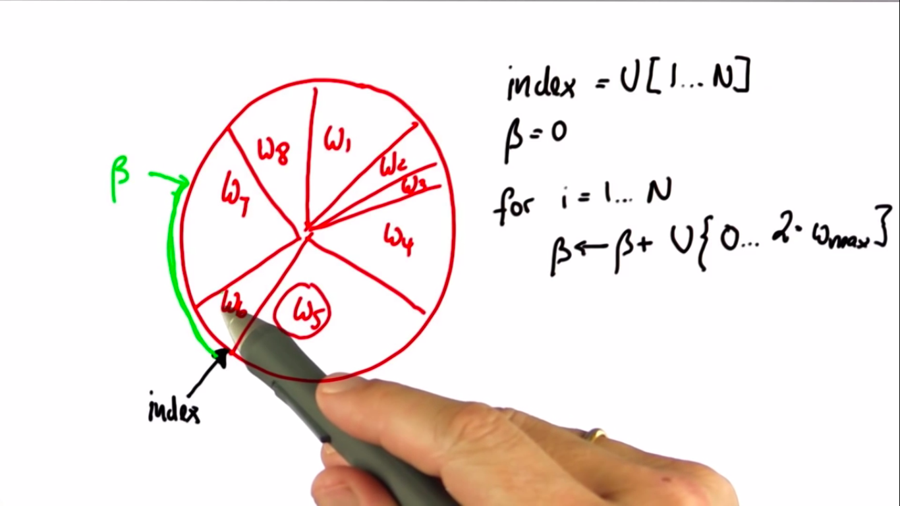
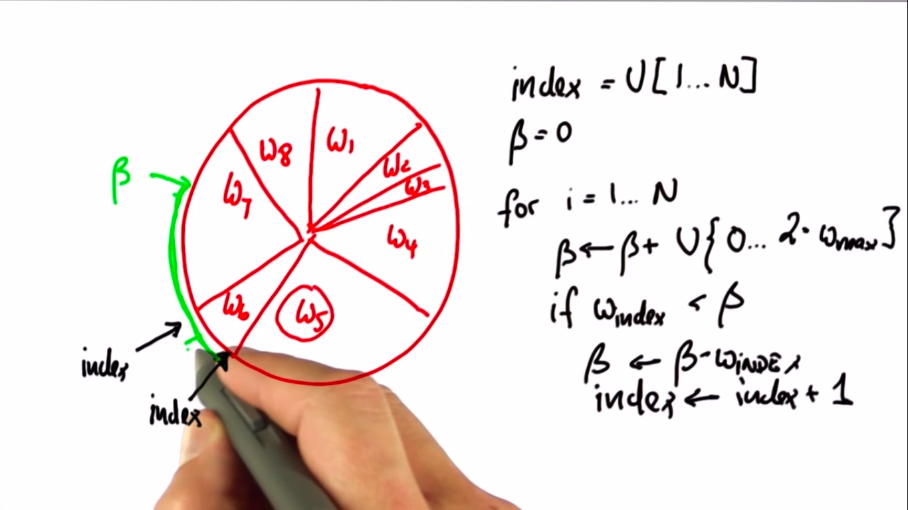
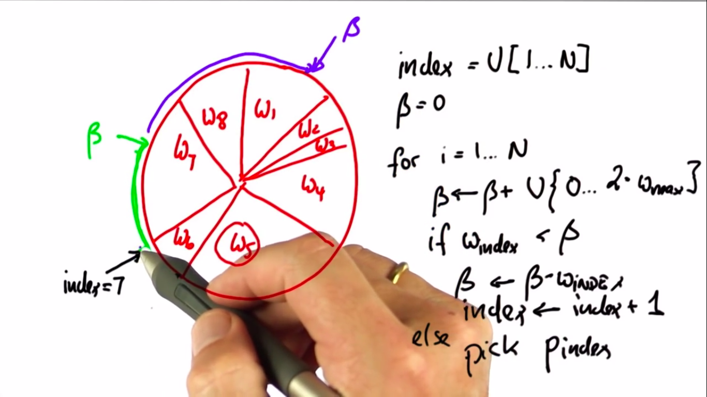
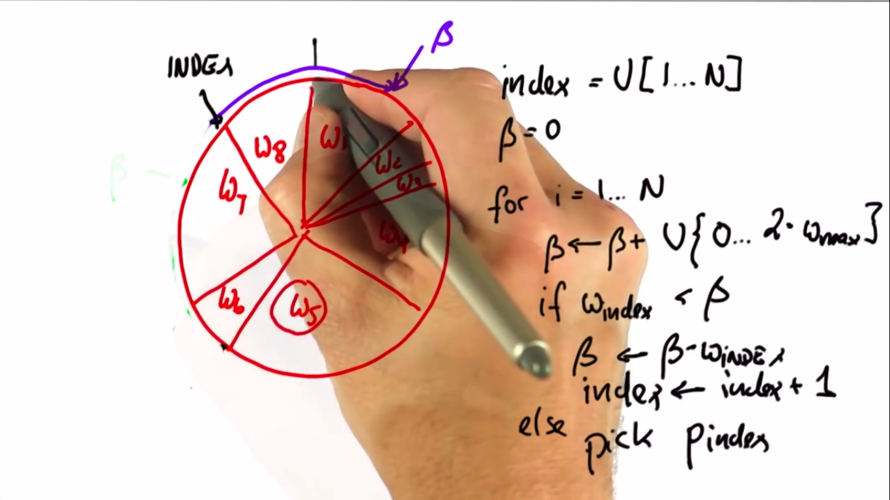
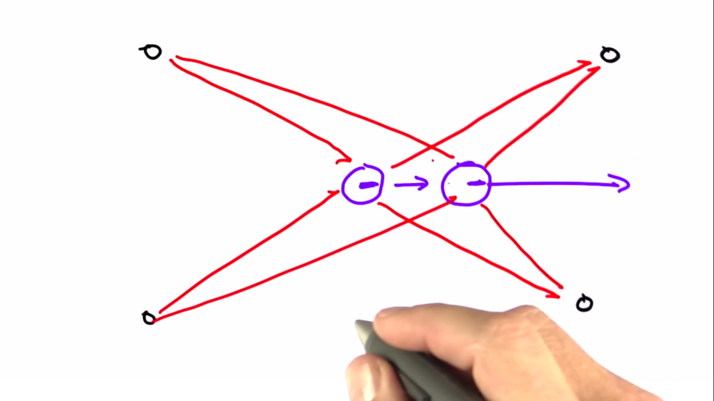
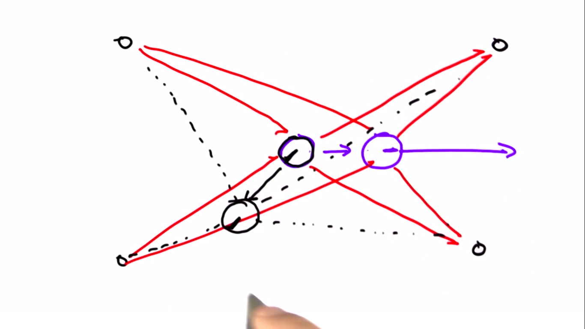

# Particle Filter-1

---

## Resampling
- N Particles, each $ (\_ ,\_ ,\_)$ (3 values)
- Weights: $[w_1, w_2, w_3, .., w_n]$
- $W=\sum_i{w_i}$
- Normalized weights: $[\alpha_1=w_1/W, \alpha_2=w_2/W, .., \alpha_n=w_n/W]$
- Pick large $\alpha$ values. By some chance we might even pick up small $\alpha$ values. Multiple times picking up the same element is also possible.
- For N particles, we do this process N times.
- This is called resampling.



## Resampling Wheel
- How to code the picking up part?
1. Take a $\beta$ and use a uniform distribution $U[0, 1]$ and for every particle check if it is less than or greater than $\beta$. Accordingly make the decision.
2. Resampling wheel:
> **Incorrect Algorithm Notice**
>  The pseudocode in the screenshots should be like this (instead of an if-else block):
> ```
> while w[index] < beta:
>     beta = beta - w[index]
>     index = index + 1
> select p[index]
> ```

- Take index from uniform set of discrete choices $U[1..N]$.
- Take initial $\beta=0$
- Algorithm:
**for i = 1..N:**
$$
\beta \leftarrow \beta + U\{0..2.w_{max}\} \\
while \ w_{index}<\beta: \\
\{
\beta \leftarrow \beta - w_{index} \\
index \leftarrow index +1
\} \\
pick \ p_{index}
$$
- If index is less than $\beta$, then we subtract $w_{index}$ from $\beta$ and increase the index.

- Similarly, for next steps.

- Index keeps on increasing, and we choose that particle (on which the arrow lands).


### Note:
- It might be possible that $U\{0..2.w_{max}\}$ yields a very low value and as a result, index is not changed in the next iteration.
  - **As a result, the same particle is choosen twice (or more)**.
- **The heading direction plays no role, as the measurements will be same regardless of the direction**.

## Orientation
- Will orientation never play a role?
  - No, eventually it will matter.
  - It will matter from the next iteration.
  - Assume this direction: 
  - If we change the direction, measurements will be different: 
