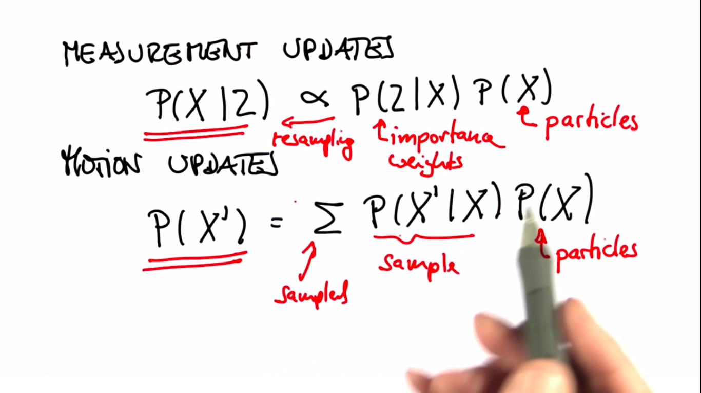

# Particle Filter-3

---

## Comparison with standard math equations
- We implemented the same equations in the particle filter.
- Measurement Updates
  - $P(X|Z) \propto P(Z|X).P(X)$
  - $P(X|Z) \leftarrow_{resampling} (importance \ weights).(particles)$
- Motion Updates
  - $P(X')=\sum P(X'|X).P(X)$
  - $P(X')=sampled \ (sample).(particle)$

- We can test for satistfying conditions, ex. prove convergence if $number(particles) \rightarrow \infty$
